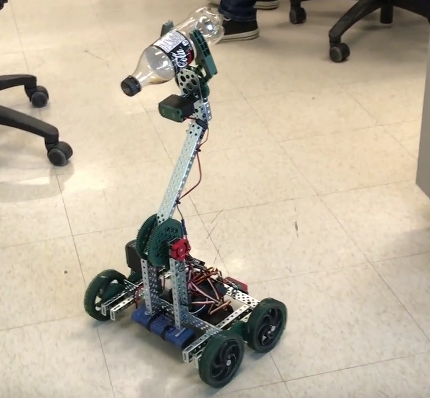

# Clawbot

## Description:

A C++ program That uses TCP/IP to interface with a robot and control it romotely. The robot can move in all directions as well as raise and lower its arm and open and close its claw.
The program sends commands to the robot and recieves telemetry data from it to determine whether the commands are being recieved.

This application uses socket programming, multi-threading, CRC, TCP/IP protocols as well as object oriented programming.

**Team Members**: [Suhaib Saqib](https://github.com/suhaib-saqib), [Roana Almira](https://github.com/roanaalmira)

**Pictures**:

